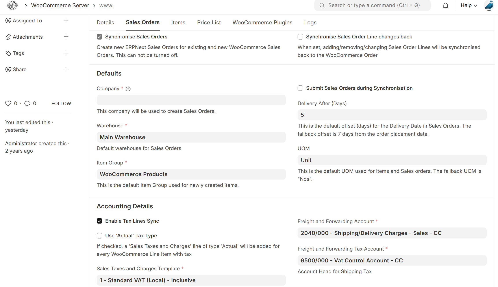

<div align="center" markdown="1">


# WooCommerce Fusion

**WooCommerce Fusion**

</div>


### WooCommerce Fusion


[](https://codecov.io/gh/dvdl16/woocommerce_fusion)

WooCommerce Fusion

### License

GNU GPL V3

The code is licensed as GNU General Public License (v3) and the copyright is owned by Starktail (Pty) Ltd and Contributors.


### Features

WooCommerce connector for ERPNext v15

This app allows you to synchronise your ERPNext site with **multiple** WooCommerce websites

- Sales Order Synchronisation
- Item Synchronisation
- Sync Item Stock Levels
- Sync Item Prices
- Integration with WooCommerce Plugins

### User documentation

📄 User documentation is hosted at [woocommerce-fusion-docs.starktail.com/woocommerce_fusion_introduction](https://woocommerce-fusion-docs.starktail.com/woocommerce_fusion_introduction)

### Installation

You can install this app using the [bench](https://github.com/frappe/bench) CLI:

```bash
cd $PATH_TO_YOUR_BENCH
bench get-app $URL_OF_THIS_REPO --branch develop
bench install-app woocommerce_fusion
```

### Development

#### Tests

1. Navigate to the app directory
```shell
cd frappe-bench/apps/woocommerce_fusion
```

2. Start Wordpress Playground
```shell
npx @wp-playground/cli server --blueprint wp_woo_blueprint.json  --site-url=https://woo-test.localhost
```

3. Start Caddy
```shell
caddy run --config wp_woo_caddy --adapter caddyfile
```

*Should you want to check out the locally running wordpress instance, navigate to [https://woo-test.localhost](https://woo-test.localhost) in your browser. The default login details are `admin` and `password`. Also, ensure an entry exists in your hosts file that points woo-test.localhost to 127.0.0.1*

4. Set the correct environment variables and run the tests
```shell
export WOO_INTEGRATION_TESTS_WEBSERVER="https://woo-test.localhost"
export WOO_API_CONSUMER_KEY="ck_test_123456789"
export WOO_API_CONSUMER_SECRET="cs_test_abcdefg"
export DEV_SERVER=1
bench --site test_site run-tests --app woocommerce_fusion --coverage
```

To run unit tests:

```shell
bench --site test_site run-tests --app woocommerce_fusion --coverage
```

To run UI/integration tests:

The following depencies are required
```shell
sudo apt update
# Dependencies for cypress: https://docs.cypress.io/guides/continuous-integration/introduction#UbuntuDebian
sudo apt-get install libgtk2.0-0 libgtk-3-0 libgbm-dev libnotify-dev libgconf-2-4 libnss3 libxss1 libasound2 libxtst6 xauth xvfb

sudo apt-get install chromium
```

```shell
bench --site test_site run-ui-tests woocommerce_fusion --headless --browser chromium
```

#### Contributing

This app uses `pre-commit` for code formatting and linting. Please [install pre-commit](https://pre-commit.com/#installation) and enable it for this repository:

```bash
cd apps/woocommerce_fusion
pre-commit install

#(optional) Run against all the files
pre-commit run --all-files
```

Pre-commit is configured to use the following tools for checking and formatting your code:

- ruff
- eslint
- prettier
- pyupgrade


We use [Semgrep](https://semgrep.dev/docs/getting-started/) rules specific to [Frappe Framework](https://github.com/frappe/frappe)
```shell
# Install semgrep
python3 -m pip install semgrep

# Clone the rules repository
git clone --depth 1 https://github.com/frappe/semgrep-rules.git frappe-semgrep-rules

# Run semgrep specifying rules folder as config 
semgrep --config=/workspace/development/frappe-semgrep-rules/rules apps/woocommerce_fusion
```

#### Updating Documentation

For documentation, we use [vitepress](https://vitepress.dev/). You can run `yarn docs:dev` to preview the docs when applying changes

#### CI

This app can use GitHub Actions for CI. The following workflows are configured:

- CI: Installs this app and runs unit tests on every push to `develop` branch.
- Linters: Runs [Frappe Semgrep Rules](https://github.com/frappe/semgrep-rules) and [pip-audit](https://pypi.org/project/pip-audit/) on every pull request, as well as [Semgrep](https://semgrep.dev/docs/getting-started/)

